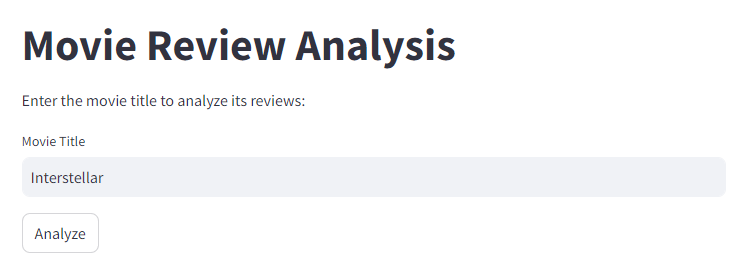

# IMDb Movie Scraper and Sentiment Analysis

## Project Status: 🚧 Work in Progress 🚧

### Overview

The **IMDb Movie Scraper and Sentiment Analysis** project aims to automate the process of gathering movie data from IMDb, categorizing user reviews based on sentiment analysis, and summarizing the findings into a comprehensive dashboard. This project is designed to provide users with valuable insights into movie reviews and ratings effortlessly.

### Features

- **🎥 Movie Title Input**: Users can input the title of the movie they want to analyze.
- **🕸️ Data Scraping**: Automatically scrapes data (ratings, reviews, storyline, etc.) from IMDb using BeautifulSoup.
- **🔍 Sentiment Analysis**: Reviews are categorized as positive or negative based on sentiment analysis.
- **📝 Summarization**: Summarizes positive and negative reviews for each movie.
- **📊 Dashboard Display**: Displays the extracted information in a user-friendly dashboard for easy understanding.

### Technologies Used

- **🧠 FLAN T5**: Utilized for the Language Model.
- **🔧 PEFT LoRA**: Used for fine-tuning the LLM for sentiment analysis.
- **⚡ FastAPI**: Provides a high-performance API backend for handling all data processing tasks efficiently.
- **🌐 Streamlit**: Delivers an intuitive and interactive user interface, enabling seamless interaction with the application.

### Completed Progress

- **✔️ Fine-tuning FLAN T5** for sentiment analysis tasks with an accuracy of **0.94** and a test loss of **0.237**.
- **✔️ Successfully scraped information and 20 movie reviews** from the IMDb website for each movie title inserted using BeautifulSoup.

### Current Progress

- **⚙️ Working on React** for a more interactive and dynamic interface.
- **🔄 Continuous testing and refinement** to improve the overall functionality.

### Future Plans

- **📈 Developing dashboards** for visual representation of data.
- **🎬 Adding movie recommendations** based on user preferences and review analysis.

---

Stay tuned for more updates as we continue to enhance the IMDb Movie Scraper and Sentiment Analysis project, making movie insights more accessible and engaging!